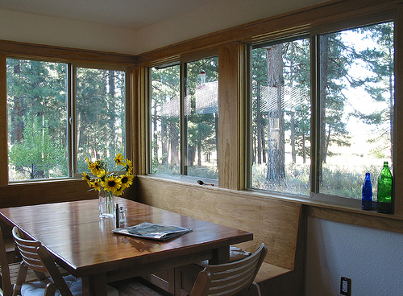

# Anonymized code for the ECCV22 submission "ClipCap: CLIP Prefix for Image Captioning"


<a href="https://opensource.org/licenses/MIT"></a>  


## Recommended: Inference Notebooks
<a href="https://colab.research.google.com/drive/1b-8QqZQHo0kD-lS8_dROZ8vsP69yzEuy?usp=sharing"></a>  
To help visualize the results we provide a Colab notebook found in `notebooks/clip_prefix_captioning_inference.ipynb`.   
The notebook will download the pretrained models and run inference on a sample images or 
on images of your choosing. It is recommended to run this in [Google Colab](https://colab.research.google.com/drive/1b-8QqZQHo0kD-lS8_dROZ8vsP69yzEuy?usp=sharing).
Both [COCO](https://drive.google.com/file/d/1FcWaTKw9SuXUwUOzn40u9dKiJwvZfBDP/view?usp=sharing) and [Conceptual Captions](https://drive.google.com/file/d/1Xoka96qpJCQAQl21HahTYUvzBvPQY8oa/view?usp=sharing) pretrained models are available for the **MLP mapping network** variant.
Inference notebook for the **transformer mapping network** (without fine-tune GPT-2) can be found [here](https://colab.research.google.com/drive/1zvPKrg0Cr44d-mda7jM65O1GdIj6ioyR?usp=sharing) for the COCO model.

## COCO training

[comment]: <> (Dependencies can be found at the [Inference notebook]&#40;https://colab.research.google.com/drive/1tuoAC5F4sC7qid56Z0ap-stR3rwdk0ZV?usp=sharing&#41; )
Clone, create environment and install dependencies:  
```
git clone https://github.com/clipcap/ECCV22 && cd ECCV22
conda env create -f environment.yml
conda activate clip_prefix_caption
```


Download [train_captions](https://drive.google.com/file/d/1mQaaTK1gdcHuYXEOBNRuA-yWU8ArhIpU/view?usp=sharing) to `data/coco/annotations`.

Download [training images](http://images.cocodataset.org/zips/train2014.zip) and [validation images](http://images.cocodataset.org/zips/val2014.zip) and unzip (We use Karpathy et el. split).

Extract CLIP features using (output is `data/coco/oscar_split_train.pkl`):
```
python parse_coco.py
```
Train with fine-tuning of GPT2:
```
python train.py --data ./data/coco/oscar_split_train.pkl --out_dir ./coco_train/
```

Train only transformer mapping network
```
python --only_prefix train.py --data ./data/coco/oscar_split_train.pkl --out_dir ./coco_train/ --mapping_type transformer  --num_layres 8
```


## COCO Examples

<table>
  <tr>
    <td></td>
    <td></td>
    <td></td>
  </tr>
  <tr>
    <td>A couple of people standing next to an elephant. </td>
     <td>A wooden table sitting in front of a window.</td>
     <td>A bunch of bananas sitting on top of a table.</td>
  </tr>
 </table>
 
 <table>
  <tr>
    <td></td>
    <td></td>
    <td></td>
  </tr>
  <tr>
    <td>A woman holding a plate with a piece of cake in front of her face. </td>
     <td>A wooden table topped with lots of wooden utensils.</td>
     <td>A red motorcycle parked on top of a dirt field.</td>
  </tr>
 </table>


## Conceptual Captions Examples

<table>
  <tr>
    <td></td>
    <td></td>
    <td></td>
  </tr>
  <tr>
    <td>3D render of a man holding a globe.</td>
     <td>Students enjoing the cherry blossoms</td>
     <td>Green leaf of lettuce on a white plate.</td>
  </tr>
 </table>
 
 <table>
  <tr>
    <td></td>
    <td></td>
    <td></td>
  </tr>
  <tr>
    <td>The hotel and casino on the waterfront. </td>
     <td>The triangle is a symbol of the soul.</td>
     <td>Cartoon boy in the bath.</td>
  </tr>
 </table>


